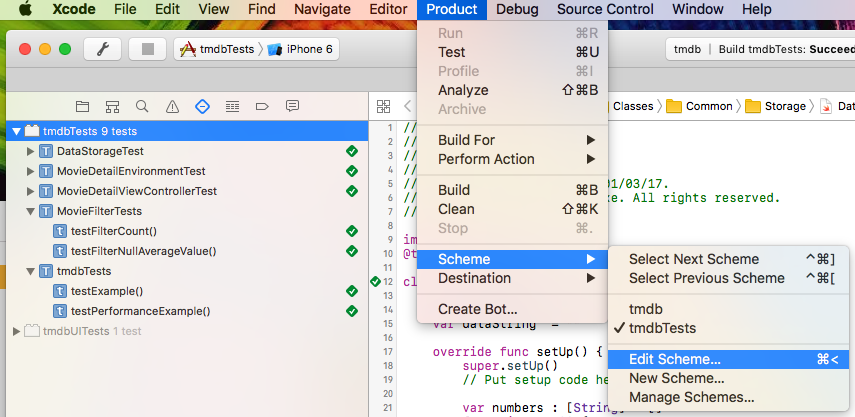
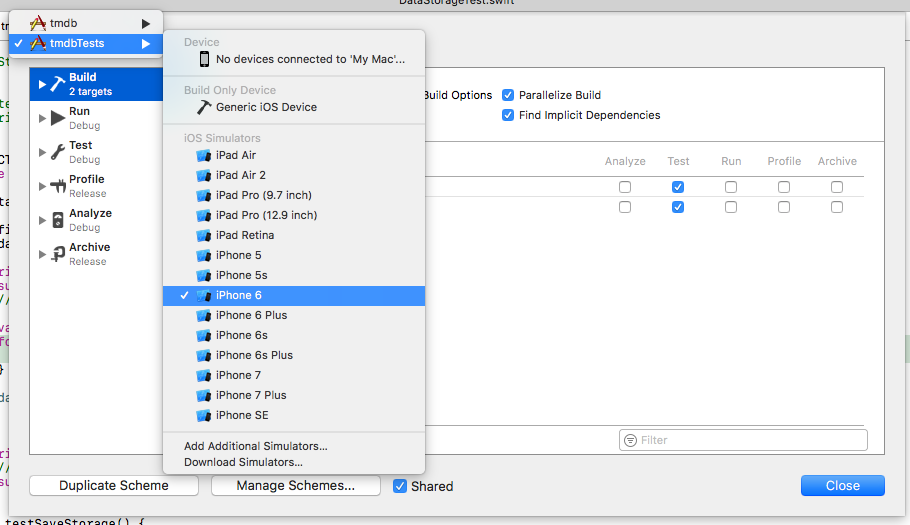
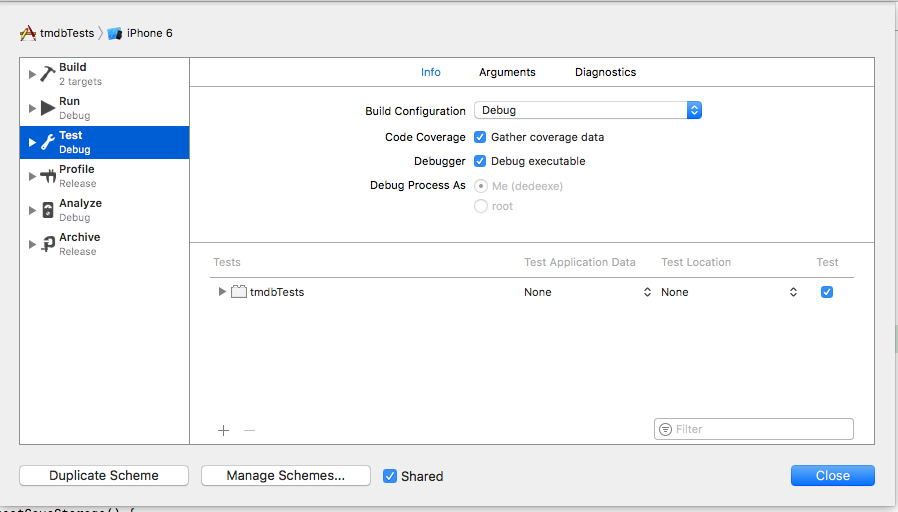
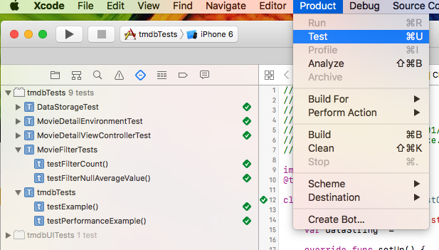
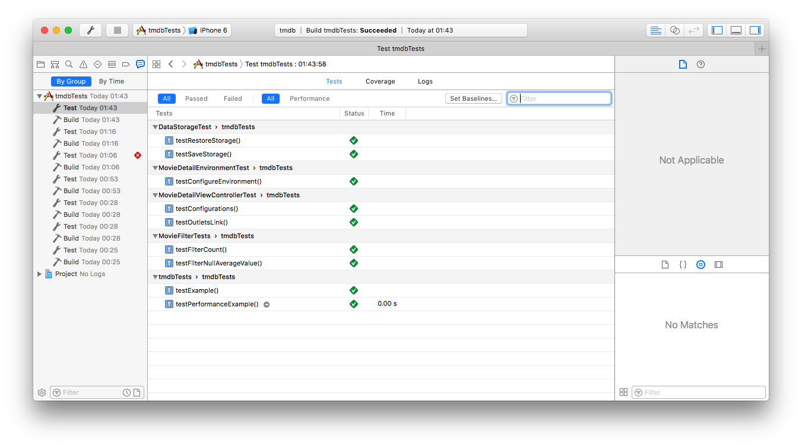
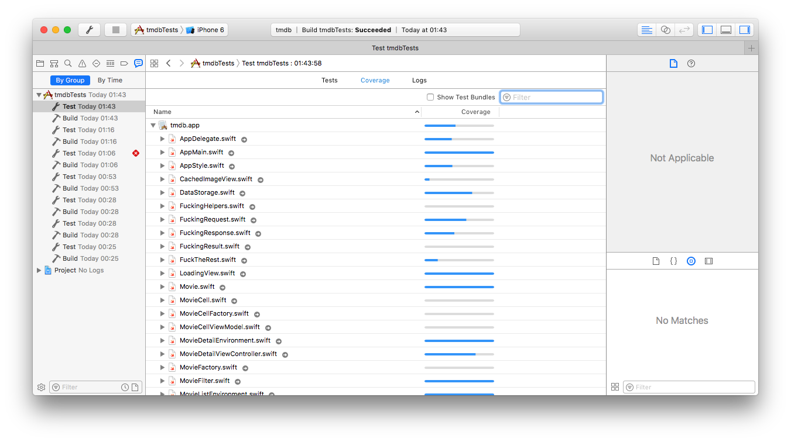

TMDB - Code Coverage
====================
####1. Open project tmdb.xcodeproj (is neceesary XCode version 8.2.1 or later)

####2. In XCode menu choose **Product** > **Scheme** > **Edit Scheme**
 
#####Xcode will show a new screen. Above the left columns in this screen select the Scheme **tmdbTests** and a device of you choive to simulate the test.  
 
#####Now in left column, choose **Test** and verify **Gather coverage data** option is checked. If not CHECK IT!!!

####3. Choose *Product* > *Test* 

####4. Analysing the result
Choose **View** > **Navigator** > **Show Report Navigator** and will see a on left side the list of latest builds and tests executed. Select the most recent test made and observe the rest report in the center Panel. 

Above the center panel, select the option Coverage, and it will show now de Code Coverage report.

