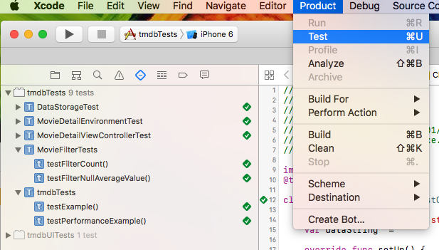

TMDB - Tests Report
===================
####1. Open project tmdb.xcodeproj (is neceesary XCode version 8.2.1 or later)

####2. In XCode menu access the menu item *View* > *Navigators* > *Show Test Navigator* (you can also press Command + 5).
 
#####On the left side now is presenting the *Test Navigator*.

####3. Choose *Product* > *Test* 

####4. Analysing the result
Now you have a list with all failed and successful tests. 
The successful tests is marked with a green badge and all failed test is marked with a red badge.

